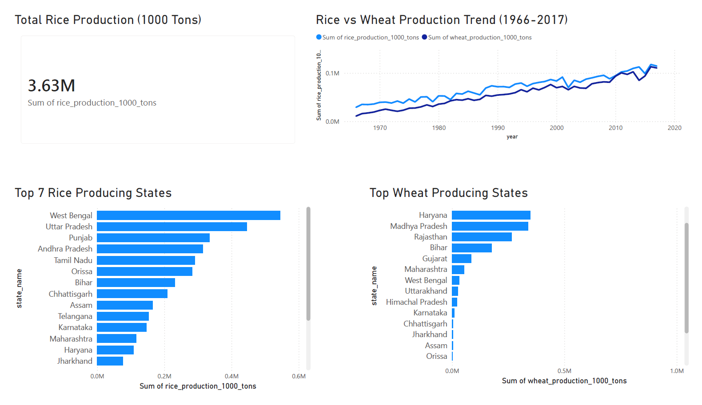

# Agriculture Production Analysis Dashboard
## Dashboard Preview

## Project Overview

This project analyzes agricultural crop production data of India.

The objective is to explore crop production trends, identify top producing states, and build an interactive dashboard.

## Tools Used

- Python
- Pandas
- Matplotlib
- Jupyter Notebook
- Power BI

## Dataset

The dataset contains district-level agriculture information:

- State
- District
- Year
- Crop area
- Production
- Yield

## Analysis Performed

### Data Cleaning
- Removed missing values
- Fixed column names
- Checked duplicates
- Converted data types

### Exploratory Data Analysis

Analyzed:

- Rice production trends
- Wheat production trends
- Sugarcane production trends
- Top producing states

## Dashboard Features

Power BI dashboard includes:

- Total rice production KPI
- Top rice producing states
- Top wheat producing states
- Rice vs wheat production trend

## Project Files

data/
notebooks/
dashboard/
images/

## Key Insights

- West Bengal emerged as one of the leading rice-producing states.
- Uttar Pradesh consistently ranked highest in wheat production.
- Rice and wheat production showed long-term growth trends across the years.
- Agricultural output increased significantly due to expansion in cultivation and productivity improvements.

## Dashboard Features

- KPI Card for Total Rice Production
- Rice Production Analysis by State
- Wheat Production Analysis by State
- Rice vs Wheat Production Trend Visualization
- Interactive Power BI Dashboard

## Author

Iliyaz Ahamed
